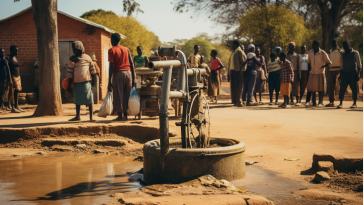

## Description
This database contains the records of a water survey for the Integrated Project.
## Maji Ndogo
 
### Data model
The database md_water_services includes more than 60 000 unique records and 43 columns. The data model, including the column names, data types and feature descriptions, is included in Table 1 ordered by table.
